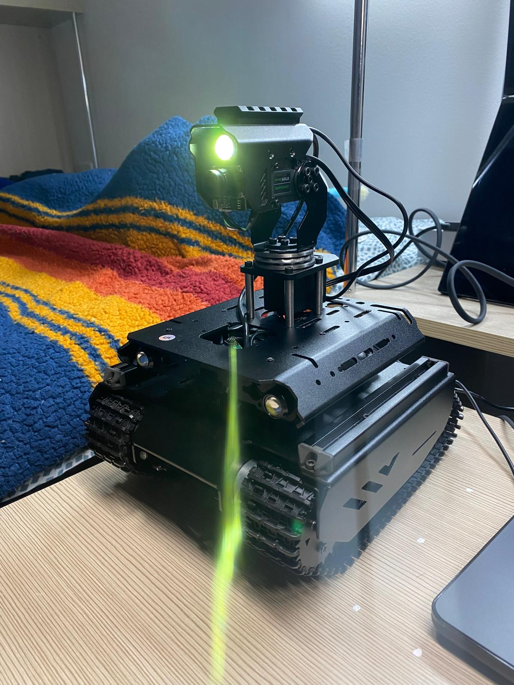

# Rover Crew — real-time embodied multi-agent navigation

Built for the **Cerebras × Google DeepMind Gemma 4 24-Hour Hackathon** (Jun 2026).

A Waveshare UGV rover that finds objects by natural-language command using a crew of
**Gemma 4** agents running on **Cerebras** ultra-fast inference. Say *"find the red cup"*
and the rover perceives, plans, and drives — with a vision-language model **in the
control loop** at ~1 second per perceive→plan→act cycle.

> The pitch: cloud LLM latency normally makes VLM-in-the-loop robotics impossible.
> Cerebras inference is fast enough to run a multimodal agent crew in real time on a
> moving robot.

**Demo video:** https://youtu.be/9HACQbHyaqE



## Architecture: split brain / body

```
┌──────────────── Laptop (brain) ─────────────────┐        ┌──── Pi (body) ────┐
│  main.py  loop @ ~3Hz                            │        │  pi_server.py     │
│    frame ─▶ perception ─▶ planner ─▶ safety ─▶ cmd ──────▶│  /frame  (camera) │
│              (Gemma 4    (Gemma 4   (rules)      │        │  /cmd    (serial) │
│               vision)     text)                  │◀───────│                   │
└─────────────────────────────────────────────────┘ frame  └───────────────────┘
```

- **Perception agent** (Gemma 4, multimodal) — reads the camera frame: is the target
  visible, what bearing/distance, any obstacle ahead.
- **Planner agent** (Gemma 4) — turns the perception report into the next action.
- **Safety agent** (rules) — vetoes driving forward into an obstacle.
- **Navigator** — maps the action to Waveshare motor commands.

## Files

| File | Runs on | Role |
|------|---------|------|
| `main.py` | laptop | control loop |
| `agents.py` | laptop | Gemma 4 agent crew (perception/planner/safety) |
| `rover_client.py` | laptop | rover comms + `USE_MOCK` webcam mode |
| `config.py` | laptop | rover IP, speeds, motor command map |
| `pi_server.py` | Raspberry Pi | camera + motor serial server |
| `vision_test.py` | laptop | one-shot check that Gemma 4 accepts images |
| `chat.py` / `list_models.py` | laptop | Cerebras sanity checks |

## Quick start

```bash
python3 -m venv .venv && ./.venv/bin/pip install -r requirements.txt
export CEREBRAS_API_KEY=csk-...

# dev with no robot — laptop webcam, prints motor commands:
USE_MOCK=1 ./.venv/bin/python main.py "coffee mug"
```

### On the rover (Raspberry Pi)

```bash
pip install flask opencv-python pyserial
python3 pi_server.py          # serves /frame and /cmd on :5000
```

Then set `ROVER_HOST` in `config.py` to the Pi's IP and run `main.py` without `USE_MOCK`.

> Verify `SERIAL_PORT` and the JSON motor command (`{"T":1,"L":..,"R":..}`) against your
> Waveshare UGV's wiki — defaults are the common case but vary by model.

## Stack

- **Model:** Gemma 4 (`gemma-4-31b`)
- **Inference:** Cerebras Cloud (OpenAI-compatible API)
- **Robot:** Waveshare UGV rover (Raspberry Pi + ESP32 sub-controller)
